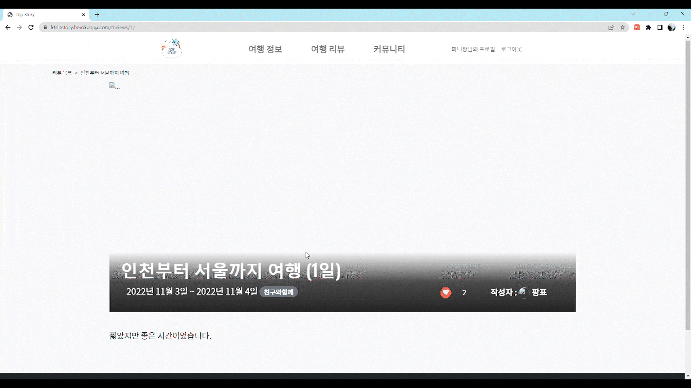

여행을 떠나는 모든 사람들을 위한 **`여행지 정보`**, **`여행지 리뷰`**, **`커뮤니티`**를 한 번에 확인할 수 있는 서비스

**[웹 사이트 주소]** 👉 https://ktripstory.herokuapp.com/

---
# 😉 팀원 💯

---

# ⚒️기술 스택

### Front_End

 
 

### Back_End

 
 

### Cooperation

 
 

### Release

 
 

---
# 개발 기간 및 일정

- **개발 기간 : 10/31 ~ 11/07**
- **개발 일정**
    - **10/31**
        - 기능 별 앱 나누기
        - DB 모델 구상
        - 앱 단위로 역할 분담
        - figma를 이용해 templates 구상
        - base templates 및  navbar 작성
        - 버전 관리: GIT
    - **11/01**
        - 앱 단위로 models 작성
        - 앱 단위로 templates 작성
        - 버전 관리:GIT
    - **11/02**
        - accounts 앱 : 회원 가입 기능 구현
        - places 앱 : CRUD 기능 구현, 기본 db 등록
        - reviews 앱 : CRUD 기능 구현
        - Error 공유
        - 버전 관리:GIT
    - **11/03**
        - 앱 단위로 templates 와 기능 테스트
        - Error 공유
        - 버전 관리:GIT
    - **11/04**
        - 앱 별로 구체적인 templates 작성
        - 커뮤니티 게시판 CRUD 기능 작성
        - Error 공유
        - 버전 관리:GIT
    - **11/07**
        - 기본 db 등록 및 최종 기능 테스트
        - 테스트 오류 수정
        - 배포
        - 버전 관리:GIT
        

 
 

---

# 🏞️템플릿 구성

### **Figma**
👉 [**피그마 바로가기**](https://www.figma.com/file/EmgE5H0PB1MRMKniXQcGKv/Trip-Story?node-id=0%3A1)

# 📚모델 구성

### **ERD**

👉 [**ERD 바로가기**](https://www.erdcloud.com/d/Jm4MHXgaQSptQsqxB)

 
 
 
 

---

# 🌈전체 기능 소개

**트립 스토리(Trip Story)**는 국내로 여행을 떠나시는 분을 위해 지역별로 인기있는 여행지를 추천해주고, 여행 리뷰를 작성하여 공유할 수 있는 여행 전문 웹 서비스입니다.

 
 

---

**여행지 정보** 페이지를 통해 **`국내 지역별`** **`인기 여행지`**를 추천해주고 **`세부 정보`**를 확인할 수 있습니다.

도시는 조회수 순으로 TOP3를 추천해주며, 도시 페이지로 들어가면 해당 도시의 사진들과 날씨, 여러 관광지들을 확인 할 수 있습니다.

 
 

---

관광지는 **`별점 순`**, **`댓글 개수 순`** TOP3를  추천해줍니다. 마음에 드는 여행지 세부정보 아래에 댓글을 달아 공감을 할 수 있습니다. 댓글에는 별점 기능을 추가하여 해당 지역에 대한 **`별점 리뷰`**를 등록할 수 있습니다. 댓글의 프로필을 클릭해 **`다른 유저의 프로필`**을 확인 할 수 있습니다.
 
 

---

**여행지 리뷰** 페이지를 통해 다녀온 여행지에 대한 리뷰를 남길 수 있습니다.  여러 도시를 골라 리뷰 할 수 있으며, **`도시별로 리뷰`**를 볼 수도 있습니다. **`좋아요 기능`**을 통해 리뷰 작성 글에 공감할 수 있습니다. 
 
 

---

**커뮤니티** 페이지를 통해 **`질문`**, **`정보 공유`** 등 서비스 이용자들이 서로 **`자유로운 소통`**을 할 수 있습니다.
 
 

---

**그 외에** 인덱스 페이지에서 검색창을 통해 **`관광지`**와 **`리뷰`**를 동시에 **`검색 가능`**합니다.

또한 다른 유저의 **`프로필`**에 들어가 **`팔로우`**를 하고 해당 유저가 쓴 리뷰를 볼 수 있습니다.

 
 
 
 

---

# 🔍세부 기능 소개
## 주요 기능

- `회원 가입`
- `로그인`
- `CRUD` 가능한 커뮤니티 게보 리뷰 조회수 기능
- `여행 정보` 리뷰 `조회수` 기능
- 커뮤니티 게시글에 `댓글` 작성
- 여행지 정보 `검색`
- 회원끼리 `팔로잉`
- 여행 리뷰에 `좋아요` 기능

# 메인

---

# 여행지

---

### 지역별 디테일

---

### 장소 추가하기

---

### 관광지 전체보기

---

### 핫플 정보

---

### 브레드 크럼(뒤로가기)

---

# 리뷰

---

### 리뷰 작성하기

---

### 리뷰 디테일

---

# 커뮤니티

---

### 커뮤니티 글쓰기

---

# 기타 기능
### 프로필

---

### 검색 기능

---

### 프로필 클릭 시 해당 프로필 정보로 이동

---

### 팔로우 기능

---

### 좋아요 기능

# 🥲특이사항

협업을 하며 다양한 개발 이슈가 있었다. 특히 GIT 에서 Merge를 수행하며 많은 충돌이 일어났다. gitignore.io사이트에서 프로젝트 특성에 맞게 파일을 다운 받은 후 수정하는 방식으로 하니 충돌이 많이 줄었다.

# 😎프로젝트 후기

## 김광표

- 많은 페이지를 기획하다 보니 혼자 모든 것을 하기는 불가능했다. 팀원들이 있기에 각각 역할 분담을 해가며 프로젝트를 완성 할 수 있었던 것 같다. 또한 일주일 동안 계속해서 깃허브로 협업을 하며 깃허브와 많이 친해질 수 있었고, 직접 배포까지 하니 그간 했던 어떤 프로젝트보다 더 뿌듯했다.
- 초기 기획을 잘 짜면 프로젝트 진행 속도가 더 빨라지고 중간에 막히는 일이 없다는 것 또한 깨달았다.

## 김준환

- 초기 기획부터 실제 배포 까지 해보면서 하나의 웹 페이지를 만들었다니 뿌듯하다. 팀원 모두가 각자 역할에 열심히 임해줘서 잘 마무리된 것 같다. 특히 협업을 하면서 깃과 깃허브에 충돌이 밥먹듯이 일어났는데 그 원인을 하나씩 알아갈 수 있어서 좋았습니다. 제가 부족한 부분도 다른 팀원들 덕에 잘 해결할 수 있었습니다.

## 서민수

- 혼자서 했다면 아마 완성하지 못했을 것이다 아직 실력이 부족하고 구현도 힘든게 많았는데
팀원들이 도와줘서 할 수 있었다.

## 이동영

- 혼자 할 때보다 더 많은 기능 구현을 할 수 있었다.
- 어려운 문제를 팀원이 같이 해결하면서 미처 몰랐던 부분을 배웠다.
- git 사용법이 익숙해졌다.
